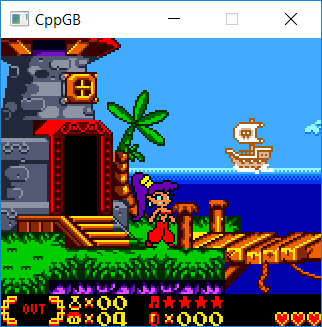
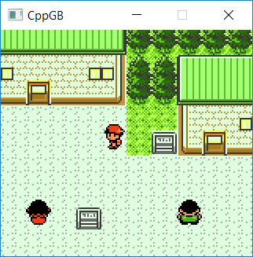

# CppGB

CppGB is a GameBoy emulator which supports DMG and CGB games. It's designed with simplicity and readability in mind. The goals were to learn more about emulator programming and to be able to play some of my favorite childhood games, therefore it's not intended to be a complete and accurate emulator. 

 
